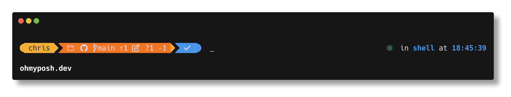

## Introduction

While working at JudicateWest, one of my coworkers introduced me to oh-my-posh. Basically it is a program that formats the command line to look nicer as well as display useful information. This blog post is a simple guide to setting up oh-my-posh for Ubuntu Linux and using my custom theme.

## Set up

1.  First thing first, you want to open a terminal and run the command

```bash
mkdir -p ~/.local/bin
curl -s https://ohmyposh.dev/install.sh | bash -s -- -d ~/.local/bin
```

This will run the oh-my-posh installation script and install the program to ~/.local/bin. Typically ~/.local/bin is the default location and the -d flag specifies the installation location so you can drop -d and everything after it if you wish.

2.  Next you will need to add the oh-my-posh binary to the path so that you can run the program as a command. This can be done with

```bash
echo 'export PATH="$HOME/.local/bin:$PATH"' >> ~/.bashrc && source ~/.bashrc
```

This will add the line `export PATH="$HOME/.local/bin:$PATH"` to the `.bashrc` file, which is the file bash reads on startup. `source ~/.bashrc` causes bash to re-read this file.

After all this you can run `oh-my-posh --version` to make sure that oh-my-posh was added to the path correctly. I am on version 29.6.1.

3.  Next up, you will need a nerd font for oh-my-posh to display some of its symbols properly. I personally use **Hack Nerd Font Mono** but you can choose any font you want. The easiest way to install fonts is to run `oh-my-posh font install`. This will show a list of fonts oh-my-posh recommends. Using the arrow keys, select Hack and press enter to install it. This will give Hack Nerd Font, Hack Nerd Font Mono, and Hack Nerd Font Propo.

4.  Now that the font is installed, you need to tell your terminal to actually use it.

    **GNOME Terminal:** On Ubuntu with the GNOME desktop environment, the default terminal is **GNOME Terminal**. Open it and go to **Edit --> Preferences**. Under the **Profiles** tab, select your active profile (usually "Unnamed") and check **Custom font**. Click the font button next to it, search for **Hack Nerd Font Mono**, and select it. Click **Close** and your terminal will now render oh-my-posh symbols correctly.

    **VS Code:** I work with VS Code's integrated terminal and the font needs to be set there separately. If you haven't installed VS Code yet, check out the [official install instructions](https://code.visualstudio.com/docs/setup/linux). Once VS Code is open, go to **File --> Preferences --> Settings** (or press `Ctrl+,`) and search for **Terminal Font Family**. In the **Terminal --> Integrated: Font Family** field, enter `'Hack Nerd Font Mono'`. The quotes are important as VS Code expects font family names in CSS format. After saving, open a new integrated terminal with `Ctrl+` `` ` `` and oh-my-posh should render properly.

5.  Now you can activate oh-my-posh. Run the following command to add the initialization line to your `.bashrc` and apply it immediately:

```bash
echo 'eval "$(oh-my-posh init bash)"' >> ~/.bashrc && source ~/.bashrc
```

This will start oh-my-posh with the default theme. To use a specific theme, see the next section.

## My Config

You can download my config [here](/hft.omp.json). Once downloaded, move it to the oh-my-posh themes directory with:

```bash
mv ~/Downloads/hft.omp.json ~/.cache/oh-my-posh/themes/
```

Then run the following command to add it to your `.bashrc` and apply it immediately:

```bash
echo 'eval "$(oh-my-posh init bash --config ~/.cache/oh-my-posh/themes/hft.omp.json)"' >> ~/.bashrc && source ~/.bashrc
```

After dialing in my config, here's what the final prompt looks like:



> To generate this image yourself, run:
>
> ```bash
> oh-my-posh config export image --output oh-my-posh-theme.png
> ```
