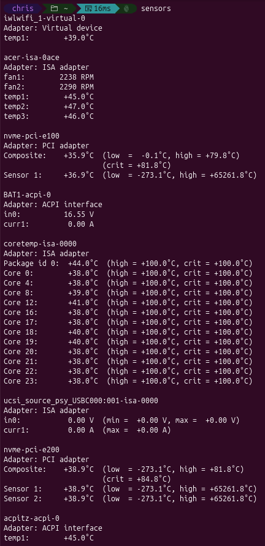
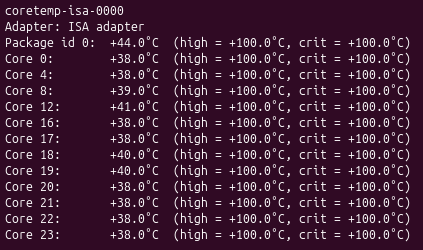
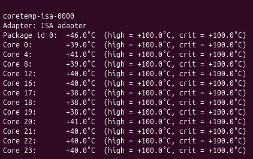
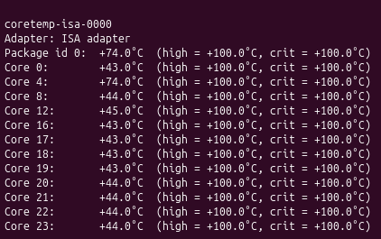
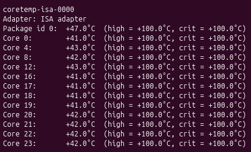
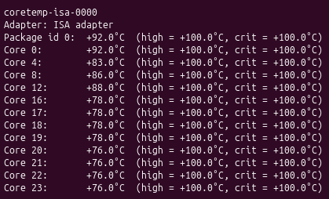
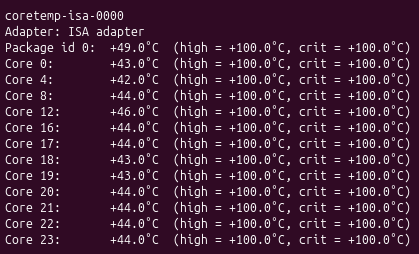
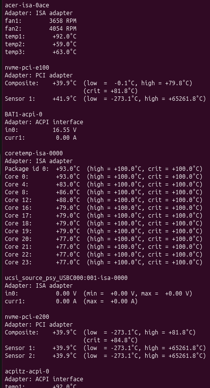
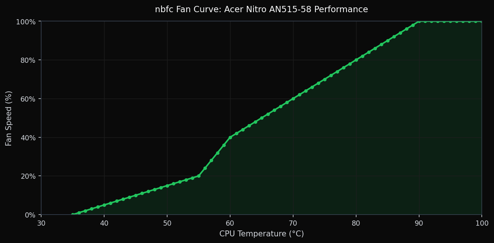

## Introduction

Last night, after playing Baldur's Gate 3 for a while and streaming it to my girlfirend over discord, my laptop black screened and would not turn back on. I tried it again after letting it sit for the night and it did boot back up. However, I had to figure out what went wrong. I suspected the laptop was over heating, so I booted into Ubuntu and ran a few tests.

## Installing the Tools

The two tools you need are `lm-sensors` and `stress`. You can install both with:

```bash
sudo apt update
sudo apt install lm-sensors -y
sudo apt install stress -y
```

`lm-sensors` reads hardware data like CPU temperature and fan speed. `stress` artificially loads the CPU so you can see how it responds under pressure.

## Monitoring Temps with sensors and watch

Run `sensors` on its own first to see what the output looks like:

```bash
sensors
```

To get a live-updating view, wrap it with `watch`:

```bash
watch -n 1 sensors
```

The `-n 1` flag tells `watch` to refresh every 1 second. Leave this running in one terminal window. Here is what the full output of `sensors` looks like on my machine at idle:


_The full sensors output on my machine at idle. Notice the fan speeds (fan1/fan2 around 2200 RPM) and the CPU package sitting at 44°C with all cores in the high 30s._

And here is just the CPU section, which is what we care most about:


_The coretemp section at idle. All cores are sitting between 38-41°C, which is a healthy resting temperature._

## Stressing the CPU with stress

Open a second terminal window and keep `watch -n 1 sensors` running in the other so you can watch temps react in real time. The full man page for `stress` is available [here](https://linux.die.net/man/1/stress).

**Test 1: Single core, 60 seconds**

```bash
stress --cpu 1 --timeout 60
```

This spawns one worker on a single CPU core and runs it for 60 seconds before stopping automatically. Good for seeing how your cooling handles a light but sustained load.


_Before Test 1: CPU package at 46°C, all cores in the high 30s to low 40s._


_During Test 1: Package jumped to 74°C. Core 4 (the stressed core) hit 74°C while the others barely moved, showing how load is isolated to a single core._

**Test 2: All cores, 30 seconds**

```bash
stress --cpu 24 --timeout 30
```


_Before Test 2: Package at 47°C, cores sitting in the low 40s._


_During Test 2: Package hit 92°C with cores ranging from 76-92°C. This is where it gets concerning. The entire CPU is saturated and temps are approaching the thermal limit._

**Test 3: All cores + memory pressure, 60 seconds**

```bash
stress --cpu 24 --vm 2 --vm-bytes 512M --timeout 60
```

`--vm 2` spawns 2 memory workers each thrashing 512MB of RAM. This more closely simulates a real workload like gaming or streaming. This is the type of workload that caused my laptop to crash.


_Before Test 3: Package at 49°C, cores in the low to mid 40s._


_During Test 3: Package hit 93°C, fans ramping to 3658 and 4054 RPM. The chassis temps (temp1/temp2/temp3 under acer-isa-0ace) also climbed to 92°C, 59°C, and 63°C, showing the heat is spreading through the whole system._

## What Happened

The results confirmed my suspicion. At idle, my CPU package sits around 46-49°C, which is totally normal. Test 1 with a single core pushed it to 74°C, which is still fine. But the moment all 24 cores were under load, temps shot up to around 80°C almost instantely and 92-93°C within 15 seconds of running. The fans were audibly kicking in hard around 90°C, ramping from roughly 2200 RPM at idle up to 3658 and 4054 RPM under full load. That is exactly the behavior that caused the black screen. The CPU hit its thermal limit, triggered a shutdown to protect itself, and the laptop wouldn't come back on until it had cooled down enough.

## Conclusion

My laptop is a gaming laptop that I bought in November 2023, so it's coming up on 3 years old. At that age, the thermal paste between the CPU and heatsink has likely dried out and lost a lot of its conductivity, which means heat isn't transferring to the heatsink as efficiently as it used to. On top of that, the fans weren't ramping up aggressively enough early enough. I could hear them really start to blast around 90°C, but by then the CPU was already close to its thermal limit.

After running these tests, I used nbfc to set a custom fan curve so the fans ramp harder starting around 80°C and approach max speed around 90°C. Here is what that curve looks like:


_The nbfc fan curve for the Acer Nitro AN515-58 Performance profile. Fans stay quiet below 55°C, ramp steadily through the 60-75°C range, and hit 80% by 80°C._

This is a good step and should buy some headroom, but it is a half measure. Pushing more air through a system with degraded thermal paste only helps so much. The real fix is replacing the thermal paste so heat actually transfers out of the CPU efficiently before the fans even need to work that hard. That is my next step, and I will post a follow-up once I have done it.
